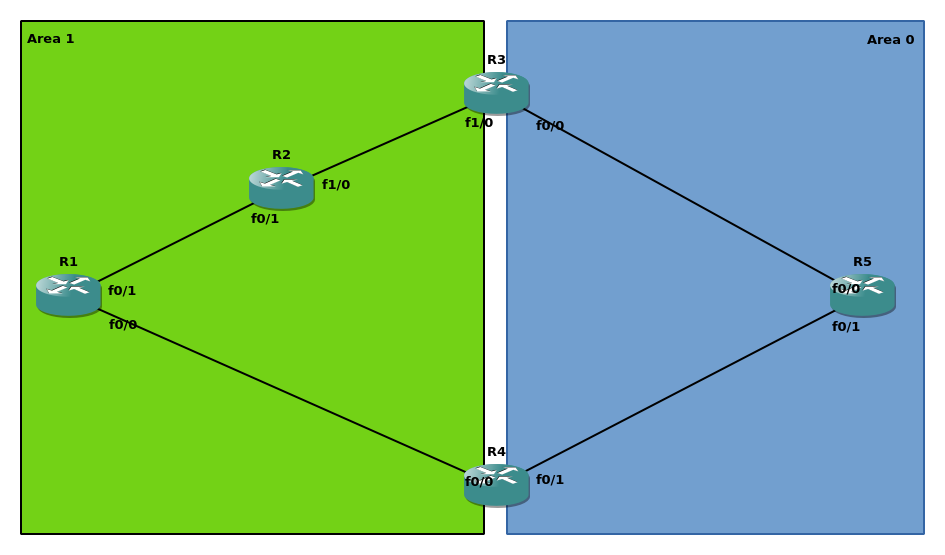

# Overview
OSPF is a link-state IGP that resolves loops by creating a forwarding tree based on Djikstra algorithm within a single area. The behavior between the areas, however, resembles distance-vector IGPs that just send a prefix along with a cost; that’s the reason why OSPF is sometimes referred to as hybrid IGP (LS and DV combined). The loop prevention mechanism is quite simple, though: all areas connect to area 0, backbone (A0), that is responsible for passing prefixes to other areas; there is no direct route exchange between non-backbone areas.
There is a well-known [YAK](https://blog.ipspace.net/2017/01/ospf-forwarding-address-yet-another.html) in the wild called OSPF Virtual Link. Everyone knows it’s a bad design, everyone agrees it should not be used unless completely necessary; yet there is little if any information why exactly that is not a good idea except introducing extra complexity. We are engineers not afraid of challenges so let’s look for a better argument. 

# Lab setup
As always, there is nothing better than a lab and solid access to google.com. I used GNS3 with Cisco 7200 images to emulate the whole topology that can be found below:

Each of the routers has a loopback0 for OSPF RID and other infrastructure purposes in a corresponding area; ABRs allocate loopbacks to A0. The addressing follows the scheme 192.168.xy.x|y/24 for Rx and Ry (e.g. 192.168.12.1 on R1 f0/1 interface). Besides a common OSPF, there is also a virtual link (VL) between R1 and R3, just for R1 to feel cozy in a warm backbone area.

# Loop generation
For those of you who are rightfully keen on testing connectivity, please, feel free to use TCL and check pings everywhere; I’m going to focus on R1-R5 connectivity. That being said, let’s check it:

```shell
R1#ping 5.5.5.5 so lo 0
Type escape sequence to abort.
Sending 5, 100-byte ICMP Echos to 5.5.5.5, timeout is 2 seconds:
Packet sent with a source address of 1.1.1.1 
!!!!!
Success rate is 100 percent (5/5), round-trip min/avg/max = 20/30/40 ms
R1#traceroute 5.5.5.5 so lo 0 numeric
Type escape sequence to abort.
Tracing the route to 5.5.5.5
VRF info: (vrf in name/id, vrf out name/id)
  1 192.168.14.4 16 msec 24 msec 20 msec
  2 192.168.45.5 48 msec 16 msec 24 msec
```

So far so good, the connectivity is there, and traffic follows a correct path even in the presence of VL. Now for the magic part of this article: résumé-generating config.

```shell
R1(config)#router os 1
R1(config-router)#no capability transit 
```

Transit area capability is a feature introduced in OSPFv2 that allows traffic following a virtual link to take a more optimal path if one exists. It compares the prefix received via virtual-link with LSA3; if there is an exact prefix match and LSA3 describes a better path – choose path via LSA3. OSPFv1 originally suggested that traffic should take the same scenic route as virtual links emulating area 0 point-to-point circuits. If you want to get more intimate with transit areas and virtual-links, I suggest reading [this article](https://blog.ine.com/2009/09/14/understanding-ospf-transit-capability) by Petr Lapukhov. If you feel confident with the basics of VL, go ahead and jump straight into verification:

```shell
R1#traceroute 5.5.5.5 so lo 0 n
Type escape sequence to abort.
Tracing the route to 5.5.5.5
VRF info: (vrf in name/id, vrf out name/id)
  1 192.168.12.2 44 msec 16 msec 20 msec
  2 192.168.23.3 20 msec 40 msec 40 msec
  3 192.168.35.5 76 msec 44 msec 44 msec
```

Now R1 traffic takes a longer path compared to the initial choice. The reason for that is the absence of transit capability that forces R1 to send packets along the path VL takes: R1-R2-R3. Although it is not optimal, such a behavior might be expected; the connectivity is still there. However, there is no sign of a loop. Yet. Let’s add some spice:

### R2
```shell
R2(config)#int f1/0
R2(config-if)#ip os cost 100
```
### R3
```shell
R3(config)#int f1/0      
R3(config-if)#ip os cost 100
```

OK, we made a worse path even less optimal, so what?

```shell
R1#traceroute 5.5.5.5 so lo 0 n
Type escape sequence to abort.
Tracing the route to 5.5.5.5
VRF info: (vrf in name/id, vrf out name/id)
  1 192.168.12.2 20 msec 16 msec 16 msec
  2 192.168.12.1 24 msec 16 msec 16 msec
  3 192.168.12.2 36 msec 32 msec 44 msec
  4 192.168.12.1 28 msec 36 msec 40 msec
  5 192.168.12.2 44 msec 48 msec 64 msec
  6 192.168.12.1 60 msec 60 msec 60 msec
  7 192.168.12.2 80 msec 80 msec 80 msec
  8 192.168.12.1 84 msec 76 msec 76 msec
<output greedily omitted>
```

Hail to the loop, ladies and gentlemen! Let’s take a few sips of coffee and reflect on what has been done so far:
* VL between R1-R3;
* Transit capability disabled;
* R2-R3 cost increased.
The latter point could be rephrased though: R2 now chooses R1 as a next-hop for 5.5.5.5/32:

```shell
R2#sho ip ro 5.5.5.5 255.255.255.255 longer-prefixes 
      5.0.0.0/32 is subnetted, 1 subnets
O IA     5.5.5.5 [110/4] via 192.168.12.1, 00:06:21, FastEthernet0/1
```

Such a choice is rather expected. R1, on the other hand, might have made a weird pick on the first glance:

```shell
R1#sho ip ro 5.5.5.5 255.255.255.255 longer-prefixes 
      5.0.0.0/32 is subnetted, 1 subnets
O        5.5.5.5 [110/103] via 192.168.12.2, 00:08:07, FastEthernet0/1
```

However, it’s a natural choice according to the rules without transit capability:
* 5.5.5.5/32 is reachable via VL in A0
* traffic follows VL path

And, of course, the latter is redirected back by R2 that has no clue about VL nor transit capability; in this case - just following LSA3.
So far it seems that transit capability is the villain here, not a VL. The explanation is rather simple: such a problem existed in OSPFv1 and was resolved by transit capability introduced in OSPFv2. One might say that such a behavior resembles microloops and I would agree; however, microloops is a transient state while OSPFv1 VL might have introduced a permanent loop.

# RFC 1247
OSPFv2 RFC includes the following about differences from OSPFv1:
> *"When summarizing information into a virtual link's transit area, version 2 of the OSPF specification prohibits the collapsing of multiple backbone IP networks/subnets into a single summary link."*


The problem gallantly described in this statement was actually a permutation of the behavior in our topology. If OSPF backbone routes were summarized on ABRs, this summary would not be used by virtual-link router. The forwarding would be broken by different views on the topology:
* Virtual-link router followed native backbone route via virtual-link, exactly the same path as virtual-link;
* Everyone else in the area except ABRs followed summarized route.
In our case, if R3 could summarize 5.5.5.0/24 for instance, R2 would choose another summarized 5.5.5.0/25 path via R4 causing a loop. Solution? Enforce consistent view on the topology by prohibiting area 0 route modification a.k.a. summarization. Note that there is no need to enforce the same for summary from other areas – those summaries would be consistent in area 0 and further anyway because only the first ABR is allowed to summarize the area prefixes. Moreover, while summarization is prohibited, there is no such restriction for filtering with transit capability. Filtering does not modify the prefix, so transit capability has just fewer LSA1-LSA3 pairs to choose from.

# Summary
Lesson learned: some defaults are there for a reason.

P.S. There is yet another way to shoot yourself in the leg, although it’s a fairly known [gotcha](https://www.cisco.com/c/en/us/support/docs/ip/open-shortest-path-first-ospf/117824-config-ospf-00.html)
